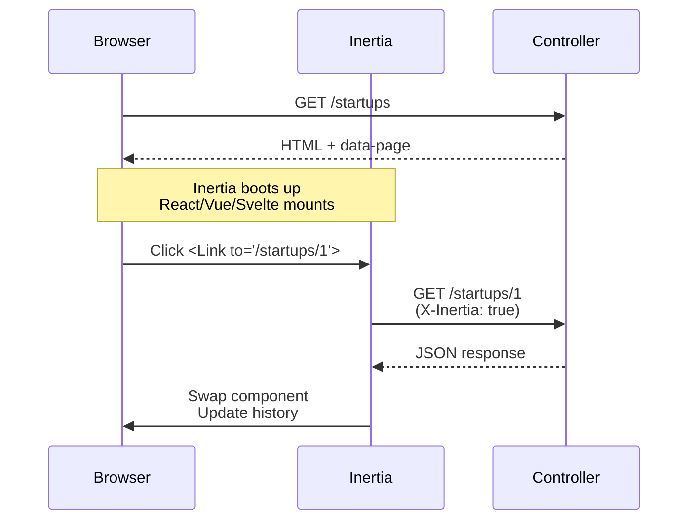

# inertia x rails = 🔥, or how to build modern monolithic SPAs 🤯

## Slide 1: Why inertia.js?
It allows you to create fully client-side rendered, single-page apps, without the complexity.

It does this by leveraging existing server-side patterns that you already know & love.

## Slide 2: What is inertia.js?
A new approach to building classic server-driven web apps

- No need to build REST/GraphQL APIs
- No client-side routing required
- No separate authentication/authorization system
- No client-side state management headaches
- No new deployment strategy
- Write react/vue/svelte components while sticking to rails conventions

Think of inertia.js as the glue between your Rails backend and the JS frontend of your choice (react, vue, svelte..).
It then enables you to leverage the ecosystem rails is still missing on the frontend side.

## Slide 3: How does it work?
1. You build your app using Rails' existing patterns
   - Routes, controllers, middleware, auth, etc.
   - Everything stays the same except the view layer

2. Instead of ERB templates, your views are JS components
   - React, Vue, or Svelte components
   - Full power of modern frontend frameworks

3. The Magic: Client-side Routing
   - Click an inertia powered `<Link>` or submit a form with inertia `<Router>` → intercepted, made via XHR
   - Server returns JSON (component name + props) instead of HTML
   - inertia swaps the page component & updates browser history
   - Result: Smooth SPA experience! 🎉

## Slide 4: Under the hood - Protocol
1. First Visit: Regular HTML Response

```http
REQUEST
GET: http://showcase.stellaire.studio/startups
Accept: text/html, application/xhtml+xml

RESPONSE
HTTP/1.1 200 OK
Content-Type: text/html; charset=utf-8
```

```html
<html>
  <head>
      <title>Startups showcase</title>
      <link href="/css/app.css" rel="stylesheet">
      <script src="/js/app.js" defer></script>
  </head>
  <body>
      <div id="app" data-page='{
        "component": "Startups/Index",
        "props": {
          "featured_startups": [
            {
              "id": 1,
              "name": "Astreinte Vitale",
              "description": "Because each second counts.",
              "preview_image_url": "/images/startups/1.jpg"
            },
            {
              "id": 2,
              "name": "kwali",
              "description": "The best after sale service you will ever give.",
              "preview_image_url": "/images/startups/2.jpg"
            }
          ],
          "filters": {
            "sort": "newest"
          }
        },
        "url": "/startups",
        "version": "c32b8e4965f418ad16eaebba1d4e960f"
      }'></div>
  </body>
</html>
```

<a href="https://inertia-rails.dev/guide/the-protocol#html-responses">Documentation</a>

2. Subsequent Visits: JSON Responses
```http
REQUEST:
GET: /startups/1
X-Inertia: true
X-Inertia-Version: c32b8e...

RESPONSE:
HTTP/1.1 200 OK
Content-Type: application/json
```

```json
{
  "component": "Startup",
  "props": {
    "startup": {
      "id": 1,
      "name": "Astreinte Vitale",
      "description": "Because each second counts.",
      "preview_image_url": "/images/startups/1.jpg",
      "team_members": [...]
    }
  },
  "url": "/startups/1",
  "version": "c32b8e..."
}
```

<a href="https://inertia-rails.dev/guide/the-protocol#inertia-responses">Documentation</a>

## Slide 5: Under the hood - Protocol flow


## Slide 6: Setting up inertia in rails

### 1. Server-side setup

```ruby
# Gemfile
gem 'inertia_rails'
gem 'vite_rails'
```

```bash
bin/rails generate inertia:install
```

This will:
- Set up vite.js for asset bundling
- Configure TypeScript (optional)
- Install Tailwind CSS (optional)
- Setup the rails app to work with inertia
- Set up example route, controller & view component

### 2. Client-side setup
```bash
# Install Inertia's React adapter
yarn add @inertiajs/react react react-dom
```

### 3. Initialize the inertia app
```js
// app/frontend/entrypoints/application.js
import { createInertiaApp } from '@inertiajs/react'
import { createRoot } from 'react-dom/client'

createInertiaApp({
  resolve: (name) => {
    const pages = import.meta.glob('../pages/**/*.jsx', { eager: true })
    return pages[`../pages/${name}.jsx`]
  },
  setup({ el, App, props }) {
    createRoot(el).render(<App {...props} />)
  },
})
```

### 3. Now, check things are working

```bash
bin/dev
```

-> http://localhost:3100/inertia-example

## Slide 7: Application layout basic setup

```erb
<%# app/views/layouts/application.html.erb %>
<!DOCTYPE html>
<html>
  <head>
    <title>Startups showcase</title>
    <%# If you want to use React add `vite_react_refresh_tag` %>
    <%= vite_client_tag %>
    <%= vite_javascript_tag 'application' %>
  </head>
  <body>
    <%= yield %>
  </body>
</html>
```

## Slide 8: Controllers response, inertia-style
```ruby
class StartupsController < ApplicationController
  def index
    startups = Startup.
      featured.
      with_attached_preview_image

    render inertia: 'Startups/Index', props: {
      featured_startups: startups.as_json(
        include: [:id, :name, :description],
        methods: [:preview_image_url]
      )
    }
  end

  def show
    startup = Startup.find(params[:id])
    render inertia: 'Startups/Show', props: {
      startup: startup.as_json(
        include: [:team_members],
        methods: [:preview_image_url]
      )
    }
  end
end
```

## Slide 9: Frontend components rendering (w/ React)
```jsx
// app/frontend/Pages/Startups/Index.jsx
import { Head, Link } from '@inertiajs/react'

export default function Index({ featured_startups }) {
  return (
    <>
      <Head title="Our startups" />
      <div className="container mx-auto px-4">
        <h1 className="text-4xl font-bold mb-8">Our startups</h1>

        <div className="grid grid-cols-1 md:grid-cols-2 lg:grid-cols-3 gap-6">
          {featured_startups.map(startup => (
            <Link
              key={startup.id}
              href={`/startups/${startup.id}`}
              className="group hover:opacity-95 transition-opacity"
            >
              <div className="relative aspect-video overflow-hidden rounded-lg">
                
              </div>
              <h2 className="mt-4 text-xl font-semibold">{startup.title}</h2>
            </Link>
          ))}
        </div>
      </div>
    </>
  )
}
```

## Slide 10: Form submission & goodies
- inertia frontend useForm helper, or <Router> + `js-from-routes` helpers (more on that later)
- Image upload with automatic conversion to FormData for XHR
- Server-side validation with redirection & errors props

## Slide 11: Batteries included

### 1. Smart asset Versioning
```http
REQUEST:
GET: /startups/1
X-Inertia: true
X-Inertia-Version: [old-version]

RESPONSE:
HTTP/1.1 409 Conflict
X-Inertia-Location: /startups/1
```

<a href="https://inertia-rails.dev/guide/the-protocol#asset-versioning">Documentation</a>

### 2. Performance: Partial Reloads
```http
REQUEST:
GET: /startups
X-Inertia: true
X-Inertia-Partial-Data: startups
X-Inertia-Partial-Component: Startups

RESPONSE:
HTTP/1.1 200 OK
Content-Type: application/json
```
```json
{
  "component": "Startups",
  "props": {
    "filters": [ ... ],  // NOT included
    "startups": [ ... ]  // included
  }
}
```

<a href="https://inertia-rails.dev/guide/the-protocol#partial-reloads">Documentation</a>

### 3. Shared data

<a href="https://inertia-rails.dev/guide/shared-data#shared-data">Documentation</a>

### 4. Deferred props

<a href="https://inertia-rails.dev/guide/deferred-props">Documentation</a>

### 5. Link prefetching
<a href="https://inertia-rails.dev/guide/prefetching#prefetching">Documentation</a>

### 6. Classic rails html.erb views still work

So use it when it makes more sense, like for instance, with devise 🤓

## Slide 11: Now start living your best frontend life

For instance:
- Setup shadcn/ui slick & modern components
- Setup complex frontend interactions (slidesheet, drawer, etc) super fast, without handwriting boilerplate JS yourself ever again.
